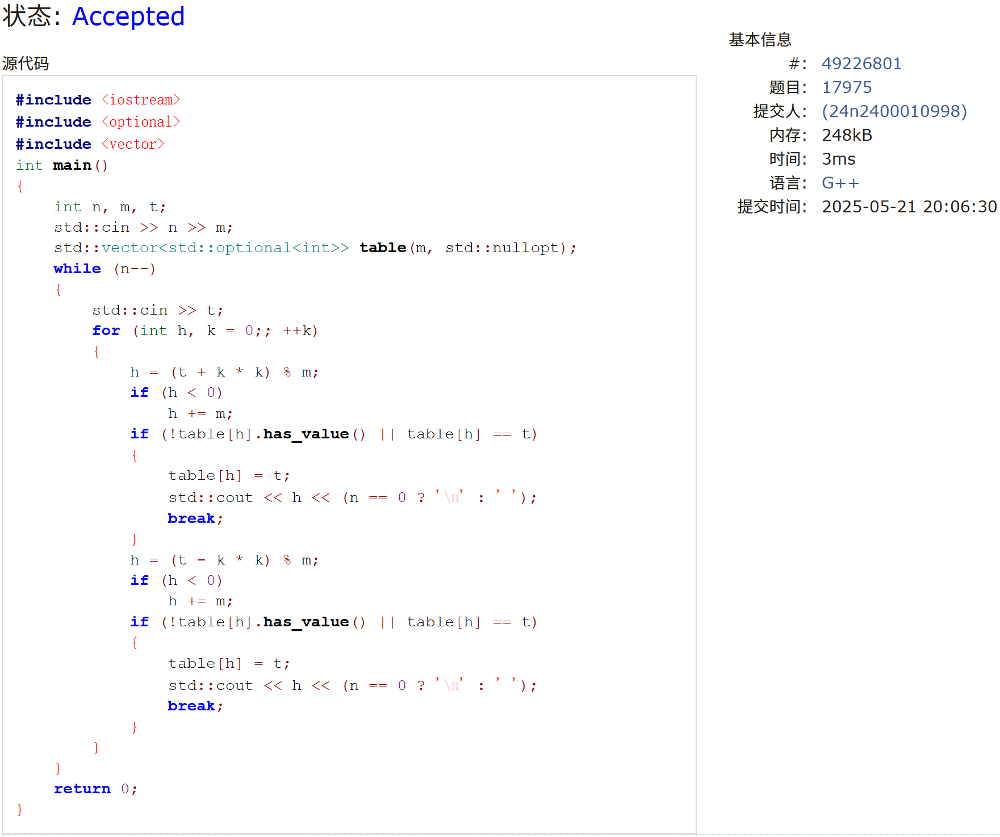

# Assignment #D: 图 & 散列表

Updated 2042 GMT+8 May 20, 2025

2025 spring, Complied by 周晟昱 工学院


> **说明：**
>
> 1. **解题与记录：**
>
>    对于每一个题目，请提供其解题思路（可选），并附上使用Python或C++编写的源代码（确保已在OpenJudge， Codeforces，LeetCode等平台上获得Accepted）。请将这些信息连同显示“Accepted”的截图一起填写到下方的作业模板中。（推荐使用Typora https://typoraio.cn 进行编辑，当然你也可以选择Word。）无论题目是否已通过，请标明每个题目大致花费的时间。
>
> 2. **提交安排：**提交时，请首先上传PDF格式的文件，并将.md或.doc格式的文件作为附件上传至右侧的“作业评论”区。确保你的Canvas账户有一个清晰可见的头像，提交的文件为PDF格式，并且“作业评论”区包含上传的.md或.doc附件。
>
> 3. **延迟提交：**如果你预计无法在截止日期前提交作业，请提前告知具体原因。这有助于我们了解情况并可能为你提供适当的延期或其他帮助。 
>
> 请按照上述指导认真准备和提交作业，以保证顺利完成课程要求。


## 1. 题目

### M17975: 用二次探查法建立散列表

http://cs101.openjudge.cn/practice/17975/

<mark>需要用这样接收数据。因为输入数据可能分行了，不是题面描述的形式。OJ上面有的题目是给C++设计的，细节考虑不周全。</mark>

```python
import sys
input = sys.stdin.read
data = input().split()
index = 0
n = int(data[index])
index += 1
m = int(data[index])
index += 1
num_list = [int(i) for i in data[index:index+n]]
```


思路：

开一个数组作为哈希表按规则探查即可。

代码：

```c++
#include <iostream>
#include <optional>
#include <vector>
int main()
{
    int n, m, t;
    std::cin >> n >> m;
    std::vector<std::optional<int>> table(m, std::nullopt);
    while (n--)
    {
        std::cin >> t;
        for (int h, k = 0;; ++k)
        {
            h = (t + k * k) % m;
            if (h < 0)
                h += m;
            if (!table[h].has_value() || table[h] == t)
            {
                table[h] = t;
                std::cout << h << (n == 0 ? '\n' : ' ');
                break;
            }
            h = (t - k * k) % m;
            if (h < 0)
                h += m;
            if (!table[h].has_value() || table[h] == t)
            {
                table[h] = t;
                std::cout << h << (n == 0 ? '\n' : ' ');
                break;
            }
        }
    }
    return 0;
}
```


代码运行截图 <mark>（至少包含有"Accepted"）</mark>




### M01258: Agri-Net

MST, http://cs101.openjudge.cn/practice/01258/

思路：

Prim算法，使用优先队列维护权值最小的出边。

代码：

```c++
#include <iostream>
#include <queue>
#include <unordered_set>
#include <utility>
#include <vector>
int main()
{
    int n, ans;
    while (std::cin >> n)
    {
        ans = 0;
        std::vector<std::vector<int>> dist(n, std::vector<int>(n));
        for (int i = 0; i < n; ++i)
            for (int j = 0; j < n; ++j)
                std::cin >> dist[i][j];
        std::priority_queue<std::pair<int, int>> edges;
        std::unordered_set<int> tree;
        tree.insert(0);
        for (int i = 1; i < n; ++i)
            edges.push({-dist[0][i], i});
        while (!edges.empty())
        {
            auto [d, u] = edges.top();
            edges.pop();
            if (tree.find(u) != tree.end())
                continue;
            ans -= d;
            tree.insert(u);
            for (int v = 0; v < n; ++v)
                if (tree.find(v) == tree.end())
                    edges.push({-dist[u][v], v});
        }
        std::cout << ans << std::endl;
    }
    return 0;
}
```


代码运行截图 <mark>（至少包含有"Accepted"）</mark>


### M3552.网络传送门旅游

bfs, https://leetcode.cn/problems/grid-teleportation-traversal/

思路：

0-1BFS，使用双端队列，将代价为0的状态压到队首，代价为1的状态压到队尾。某种传送门使用后全部删除即可。

代码：

```c++
class Solution {
public:
    int minMoves(vector<string>& matrix) {
        deque<pair<int, pair<int, int>>> q;
        vector<vector<pair<int, int>>> door(26);
        const int m = matrix.size(), n = matrix[0].size();
        vector<vector<bool>> visited(m, vector<bool>(n, false));
        for (int i = 0; i < m; ++i)
            for (int j = 0; j < n; ++j)
                if (matrix[i][j] == '#')
                    visited[i][j] = true;
                else if (matrix[i][j] != '.')
                    door[matrix[i][j] - 'A'].push_back({i, j});
        q.push_back({0, {0, 0}});
        while (!q.empty()) {
            auto [dist, pos] = q.front();
            q.pop_front();
            auto&& [i, j] = move(pos);
            if (visited[i][j])
                continue;
            if (i == m - 1 && j == n - 1)
                return dist;
            visited[i][j] = true;
            if (matrix[i][j] != '.') {
                for (const auto& [x, y] : door[matrix[i][j] - 'A'])
                    if (x != i || y != j)
                        q.push_front({dist, {x, y}});
                door[matrix[i][j] - 'A'].clear();
            }
            if (i - 1 >= 0 && !visited[i - 1][j])
                q.push_back({dist + 1, {i - 1, j}});
            if (i + 1 < m && !visited[i + 1][j])
                q.push_back({dist + 1, {i + 1, j}});
            if (j - 1 >= 0 && !visited[i][j - 1])
                q.push_back({dist + 1, {i, j - 1}});
            if (j + 1 < n && !visited[i][j + 1])
                q.push_back({dist + 1, {i, j + 1}});
        }
        return -1;
    }
};
```


代码运行截图 <mark>（至少包含有"Accepted"）</mark>


### M787.K站中转内最便宜的航班

Bellman Ford, https://leetcode.cn/problems/cheapest-flights-within-k-stops/

思路：

类似dp，每次利用一个节点的所有入边更新最小费用。通过交替使用两个数组压缩了一个维度。

代码：

```c++
class Solution {
public:
    int findCheapestPrice(int n, vector<vector<int>>& flights, int src, int dst,
                          int k) {
        vector<vector<pair<int, int>>> edge(n);
        vector<vector<int>> dist(n, vector<int>(2, 1000001));
        dist[src][0] = 0;
        for (const auto& flight : flights) {
            edge[flight[1]].push_back({flight[0], flight[2]});
            if (flight[0] == src)
                dist[flight[1]][0] = flight[2];
        }
        for (int t = 1; t <= k; ++t)
            for (int i = 0; i < n; ++i)
                for (const auto& [u, d] : edge[i])
                    dist[i][t % 2] =
                        min(dist[i][t % 2], dist[u][(t + 1) % 2] + d);
        return dist[dst][k % 2] == 1000001 ? -1 : dist[dst][k % 2];
    }
};
```


代码运行截图 <mark>（至少包含有"Accepted"）</mark>


### M03424: Candies

Dijkstra, http://cs101.openjudge.cn/practice/03424/

思路：

利用三角形不等式与最短路的相似性，将原题等效为单源最短路。

代码：

```c++
#include <climits>
#include <iostream>
#include <queue>
#include <utility>
#include <vector>
int main()
{
    int n, m;
    std::cin >> n >> m;
    std::vector<std::vector<std::pair<int, int>>> edges(n + 1);
    for (int a, b, c, i = 0; i < m; ++i)
    {
        std::cin >> a >> b >> c;
        edges[a].push_back({b, c});
    }
    std::vector<int> dist(n + 1, INT_MAX);
    dist[1] = 0;
    std::priority_queue<std::pair<int, int>> q;
    q.push({0, 1});
    while (!q.empty())
    {
        int a = q.top().second;
        if (a == n)
            break;
        if (dist[a] < -q.top().first)
        {
            q.pop();
            continue;
        }
        q.pop();
        for (const auto &[b, w] : edges[a])
            if (dist[a] + w < dist[b])
            {
                dist[b] = dist[a] + w;
                q.push({-dist[b], b});
            }
    }
    std::cout << dist[n] << std::endl;
    return 0;
}
```


代码运行截图 <mark>（至少包含有"Accepted"）</mark>


### M22508:最小奖金方案

topological order, http://cs101.openjudge.cn/practice/22508/

思路：

类似Kahn算法，通过队列访问给队伍分配奖金。

代码：

```c++
#include <algorithm>
#include <iostream>
#include <numeric>
#include <unordered_set>
#include <vector>
int main()
{
    int n, m;
    std::cin >> n >> m;
    std::vector<std::vector<int>> edges(n);
    std::vector<int> in_degree(n, 0);
    std::unordered_set<int> s;
    for (int i = 0; i < n; ++i)
        s.insert(i);
    while (m--)
    {
        int u, v;
        std::cin >> v >> u;
        edges[u].push_back(v);
        s.erase(v);
        ++in_degree[v];
    }
    std::vector<int> reward(n, 100);
    while (!s.empty())
    {
        int u = *s.begin();
        for (const auto &v : edges[u])
        {
            reward[v] = std::max(reward[v], reward[u] + 1);
            if (--in_degree[v] == 0)
                s.insert(v);
        }
        s.erase(u);
    }
    std::cout << std::accumulate(reward.begin(), reward.end(), 0) << std::endl;
    return 0;
}
```


代码运行截图 <mark>（至少包含有"Accepted"）</mark>


## 2. 学习总结和收获

线性约束可以被转化为最短路的思路一开始听到的时候还是比较惊奇的。目前正常跟进每日选做，但最短路的算法中Bellman-Ford还不太熟悉，应当自行多加练习。


